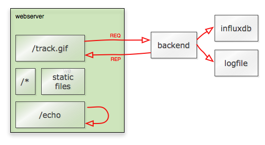

# go-beacon

Generic beacon for js trackers. It is developed with boomerang.js (https://github.com/lognormal/boomerang/) in mind, 
but can be used by any other javascript tracker. It answers to a request to an URI with a transparent GIF.

## Architecture

This webserver is build on golang http library. I've decided to serve requests straight from Go based on past experiences on scalability.
By using a regular nginx in front of it I'd basically just add another layer to a core that already can use all server cores plus Go's concurrency model.
Besides the frontend serving a hardcoded 1x1 gif, the backend is connected through mangos, a native nanomsg implementation, using REQuest/REPly mode. That means that for a single front end you can connect multiple backend or change them on the fly without stopping your process. That also means that any language that understands nanomsg and msgpack (the serialization protocol) can be used to process the requests. Besides REQREP any other topology can be used with little code changes to implement stateless architectures.
Bundled are (or will be) a statsd and a filesystem logger backend.
The default behaviour is to log a JSON of the query string to a file, but it can be plugged into any backend.

## Download and Build

    $ git clone https://github.com/gleicon/go-beacon
    $ cd go-beacon
    $ make

## Build SSL

If you want to use SSL, just set it right into the config file. In case you want a self-signed SSL:
    
    $ cd SSL
    $ make

Answer the questions and you are ready to go.

## Build Boomerang

I've implemented the boomerang async method. Just include /js/tracker.js into your web page like this:

       

The best way is to serve boomerang from a CDN, but in case you need a specific setup and want go-beacon to serve boomerang for you:

    $ cd boomerang_build
    $ make

Edit Makefile to pick a different minifier or configure the plugins that you want. 
There's a plugin called async_loading.js that implements async loading as per boomerang request, but that can be removed in the Makefile.

## Simpler tracker

If you want a simple tracker or to hack your own tracker, I've provided an example at the js/ folder. Just type make.

## Install

Edit the config file and run the server, check the beacon_uri parameter and execute the server:

	vi go-beacon.conf
	./go-beacon

Install, uninstall. Edit Makefile and set PREFIX to the target directory:

	sudo make install
	sudo make uninstall

Allow non-root process to listen on low ports:

	/sbin/setcap 'cap_net_bind_service=+ep' /opt/go-beacon/go-beacon

Gleicon 2014 - MIT License.
